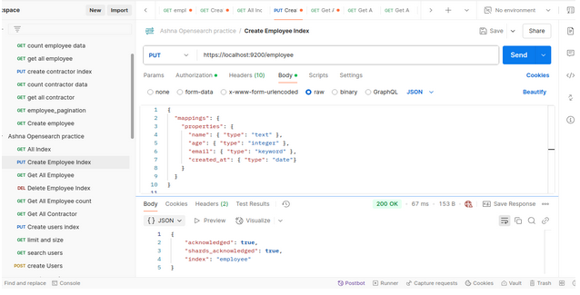
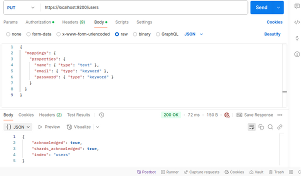
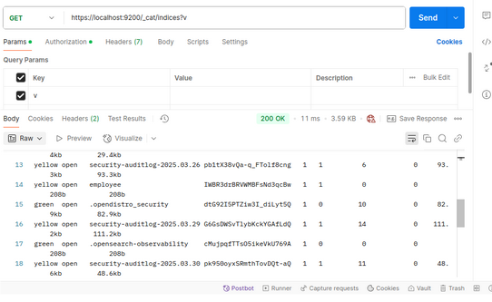
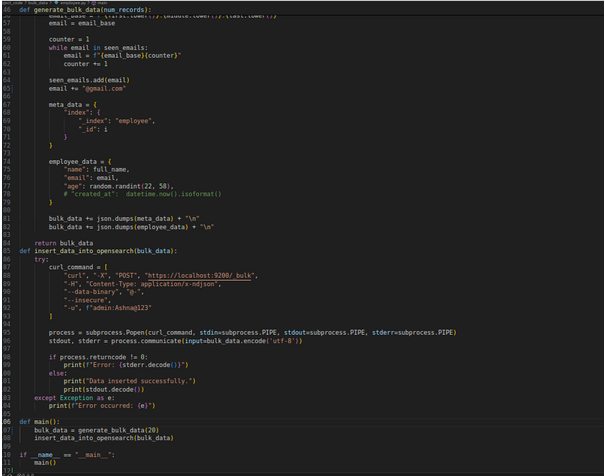
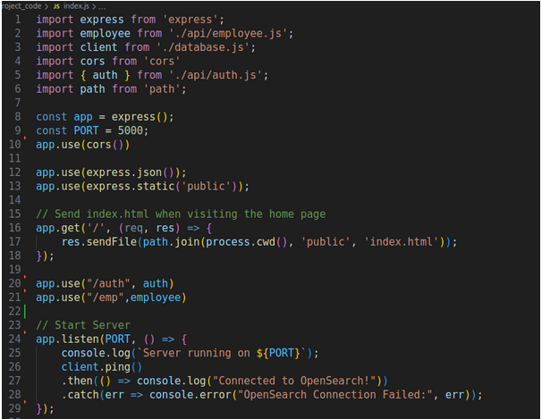
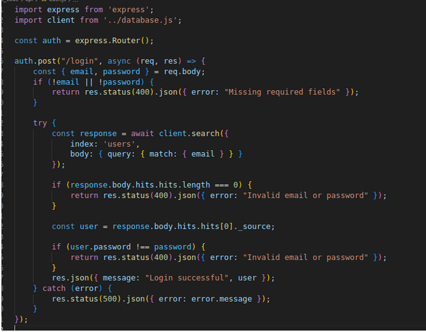
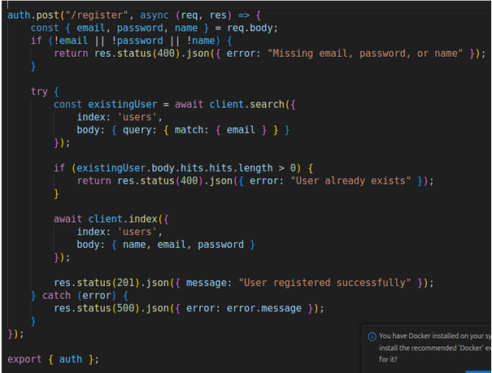
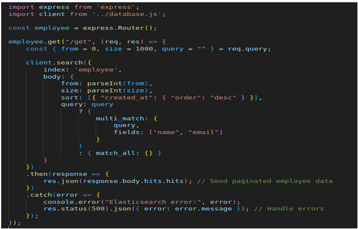
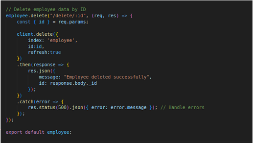

#     **IMPLEMENTATION JOURNAL \- Opensearch Crud Project**

| Submitted By | Ashna Dubey |
| :---- | :---- |
| Submitted To | Vipin Tripathi |
| Test Case Version | 1.1 |
| Reviewer  Name | Manmeet Narrang  |

**Goal**

The goal of this project is to set up an opensearch database using Podman, insert large amounts of data, implement authentication, and provide a web interface for CRUD operations .

# **Table of Contents**

[**1\. PREREQUISITES**](#prerequisites)	

1.1 Hardware Requirements	

1.2 Software Requirements	

1.3 Network Requirements	

[**STEP 1:  Setting up Opensearch with Podman**](#step-1:-setting-up-opensearch-with-podman)

Install Podman in Linux

Verify Podman Installation

Pull OpenSearch Image

Create Container using podman

Check if the container is running

Access OpenSearch in my browser

[**STEP 2: Creating employee and user index in Opensearch**](#step-2:-creating-employee-and-user-index-in-opensearch)

Creating employee index

Creating user index

Check the indices:	

[**STEP 3: Data insertion by using python**](#step-3:-data-insertion-by-using-python)

Insert data by using python script

Insert data by using command

[**STEP:04 Setting up Express Apis for crud operation**](#step:4-setting-up-express-apis-for-crud-operation)

Creating backend folder   
Initialize the express repository  
Creating index.js file  
Creating api folder inside that created auth.js and employee.js file  
Auth.js file  
employee.js file

   

1. # **PREREQUISITES** {#prerequisites}

## **1.1 Hardware Requirements**

* Minimum 4GB RAM, 2-core CPU  
* Sufficient storage for OpenSearch data

## **1.2 Software Requirements**

* Operating System: Ubuntu 24.04  
* Podman: Version 4.9.3  
* OpenSearch: Version 2.19.1  
* Python: Version 3.12.3  
* Node.js & Express.js Version 18.19.1

## **1.3 Network Requirements**

* Localhost access for development  
* Internet connection for dependency installation

## **STEP 1: Setting up Opensearch with Podman**    {#step-1:-setting-up-opensearch-with-podman}

###        **1\. Install Podman on Linux**     

| sudo apt update sudo apt install \-y podman  podman \-v |
| :---- |

###       **2.Verify Podman Installation**

| podman \-v |
| :---- |

###       **3.Pull OpenSearch Image**

Install podman image from docker hub registry

| Podman pull docker.io/opensearchproject/opensearch:latest |
| :---- |

###        **4.Create Container using podman**

| podman run \-d \--name opensearch-node1 \\   \-p 9200:9200 \-p 9600:9600 \\   \-e "discovery.type=single-node" \\   \-e "OPENSEARCH\_INITIAL\_ADMIN\_PASSWORD=Dubey@123" \\   \-v opensearch-data:/usr/share/opensearch/data \\   opensearchproject/opensearch |
| :---- |

###   5\.**Check if the container is running**  

###   6\.**Access OpenSearch in your browser**

    Open your browser and go to: [https://localhost:9200](https://localhost:9200)  
    You may get a prompt asking for username and password.

* **Username**: `admin`  
* **Password**: `Ashna@123` (the one I have set in the command)

Then will see a json response

## **STEP 2: Creating employee and user index in Opensearch** {#step-2:-creating-employee-and-user-index-in-opensearch}

### **1.Creating employee index:** 

### **2.Creating user index:**

### **2.Check the indices:**

## **STEP 3:  Data insertion by using python** {#step-3:-data-insertion-by-using-python}

## **1\.Insert data by using python script:**

## **2.Insert data by using command:**

    

| Python3 employee.py |
| :---- |

## **STEP:4 Setting up Express Apis for crud operation** {#step:4-setting-up-express-apis-for-crud-operation}

#### **1.Creating backend folder** 

            	

| mkdir podman\_opensearch\_crud\_project	 |
| :---- |

####   **2\. Initialize the express repository** 

| npm init	 |
| :---- |

| npm i (node modules) |
| :---- |

####   **3\. Creating index.js file**

| touch index.js |
| :---- |

**![][image9]**

#### **4\. Creating api folder inside that created auth.js and employee.js file**

| mkdir api && touch api/auth.js api/employee.js |
| :---- |

#### **5\. Auth.js file**

#### **4.employee.js file**

1. **Get employee**

2. **Create employee**  
   

     
3. **update employee**

    

4. **Delete employee**

       
    	  

