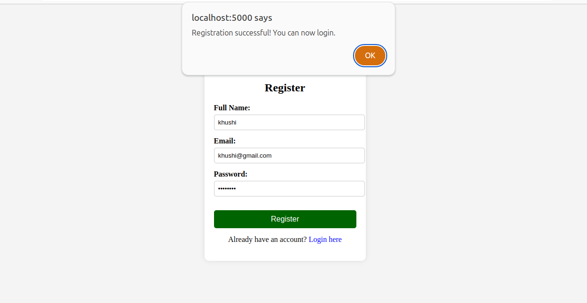
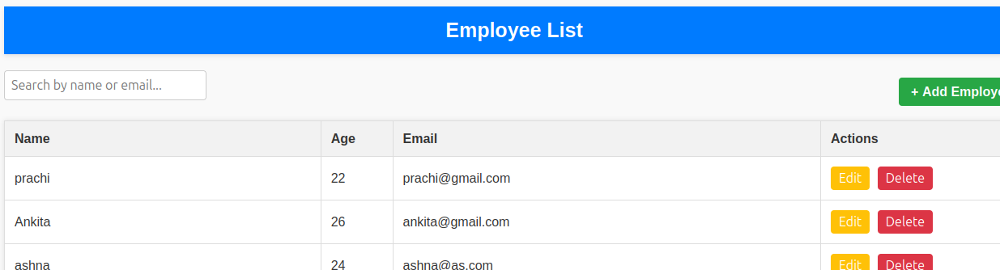
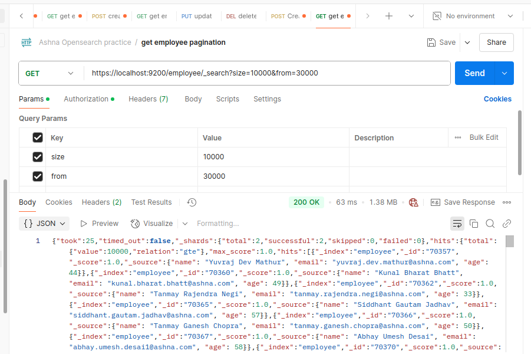

# **TEST CASES - OpenSearch CRUD System**  
| Submitted By | Ashna Dubey |
| :---- | :---- |
| Submitted To | Vipin Tripathi |
| Test Case Version | 1.1 |
| Reviewer  Name | Manmeet Narrang  |
---

## **Goal**  
This project sets up **OpenSearch** using **Podman** (a container system), inserts **100,000 records** using a **Python script**, and provides a **web-based CRUD interface** built with **Express.js**. Users must **log in** before accessing CRUD functionalities.  

---

## **Table of Contents**  
- **TC 1**: Set up OpenSearch in Podman  
- **TC 2**: Verify OpenSearch Cluster Health  
- **TC 3**: Insert Bulk Data into OpenSearch  
- **TC 4**: Validate Data Insertion in OpenSearch  
- **TC 5**: Implement User Authentication (Login Page)  
- **TC 6**: Verify Authentication Flow  
- **TC 7**: Test CRUD Operations via Web Interface  
  - **TC 7.1**: Create Operation  
  - **TC 7.2**: Read Operation  
  - **TC 7.3**: Update Operation  
  - **TC 7.4**: Delete Operation  
- **TC 8**: API Security & Authentication Check  
- **TC 9**: OpenSearch Query Performance Testing  

---

## **Test Environment**  
- **Platform**: Podman (for running OpenSearch in a container)  
- **Backend**: Express.js (handles API requests)  
- **Database**: OpenSearch  
- **Frontend**: Web interface for CRUD operations  

---

## **Test Cases**  

### **TC 1: Set Up OpenSearch in Podman**  
**Scenario**  
Ensure OpenSearch is running inside a Podman container.  

**Given**  
- Podman is installed on the system.  

**When**  
- The command to download and run OpenSearch in Podman is executed.  

**Then**  
- The OpenSearch container starts successfully.  
- Running `podman ps` displays OpenSearch as active.  

**Testing Outputs**  
(Screenshot showing the running container)  

---

### **TC 2: Verify OpenSearch Cluster Health**  
**Scenario**  
Check if OpenSearch is functioning properly.  

**Given**  
- OpenSearch is running in a container.  

**When**  
- The `GET /_cluster/health` API is called.  

**Then**  
- The API returns a `"green"` or `"yellow"` status, indicating that OpenSearch is healthy.  

**Testing Outputs**  
(JSON response from the OpenSearch cluster health check)  

---

### **TC 3: Validate Data Insertion in OpenSearch**  
**Scenario**  
Verify that OpenSearch correctly stores all 100,000 records.  

**Given**  
- Bulk data insertion was successful.  

**When**  
- The `GET /index_name/_count` API is called.  

**Then**  
- The API returns **100,000** records.  

**Testing Outputs**  
(JSON response showing the total records)  

  
### **TC 4: User Registration Functionality**

**Scenario**
Ensure new users can register successfully.

**Given**
User is on the registration page.

**When**
The user enters valid name, email, and password, and submits the form.

**Then**
A new user account is created in the database.

The user is redirected to the login page with a success message.

**Testing Outputs** 
(Screenshot of successful registration confirmation)

---

### **TC 5: Duplicate Email Registration Handling**

**Scenario**
Prevent registration with an email that already exists.

**Given**
A user account with a specific email already exists.

**When**
A new user attempts to register using the same email.

**Then**
The system displays an error message indicating the email is already in use.

**Testing Outputs**

(Screenshot of error message for duplicate email)

---

### **TC 6: User Login with Invalid Credentials**

**Scenario**

Prevent login with incorrect credentials.

**Given**
The user enters an incorrect email or password.

**When**
The login form is submitted.

**Given**
The system displays an error message indicating invalid credentials.

**Testing Outputs**
(Screenshot of login page with error message)

#### **TC 7.1: Create Operation (Add Employee)**  

**Scenario**  
 Ensure a user can add a new employee using the API.

**Given**  
- The backend server is running.
- The database is connected.

**When**  
- The user sends a POST request with valid employee details (name, email, age).
- 
**Then**  
- A new employee record is created in the database.
- The API returns a 201 Created response.
- The employee appears in the list when fetched.  
- The API returns a **success response (201 Created)**.  

**Testing Outputs**  
(Screenshot of API response & UI confirmation) 

---

---

#### **TC 8: Read Operation (Get All Employees)**  

**Scenario**  
Ensure user retrieves stored records.  

**Given**  
- OpenSearch contains records.  

**When**  
- The user searches for a specific record.  

**Then**  
- The system fetches and display the correct record.  

**Testing Outputs**  
(JSON response with search results)  

---

### **TC 9: Update Operation (Update Employee by ID)**  

**Scenario**  
 Ensure a user can update an existing employee’s details using their ID.
**Given**  
- The backend server is running.

- The database has an employee with a valid ID.

**When**  
- The user sends a PUT request to /emp/update/:id with updated data (e.g., name, age).
**Then**  
- The API returns a 200 OK response.

- The employee's details are updated in the database.

- The response contains the updated employee information.

**Testing Outputs**  
 (Screenshot of PUT request in Postman showing updated data and success response)

 

### **TC 10: Delete Operation (Delete Employee by ID)**

**Scenario**  
Ensure a user can delete an employee using their ID.

**Given**  
- The backend server is running.
- The database contains an employee with a valid ID.

**When**  
- The user sends a DELETE request to /employee/delete/:id.

**Then**  
- The API returns a 200 OK response.

- The employee is removed from the database.

- The response confirms successful deletion.

**Testing Outputs**
(Screenshot of DELETE request in Postman showing success message)

 

