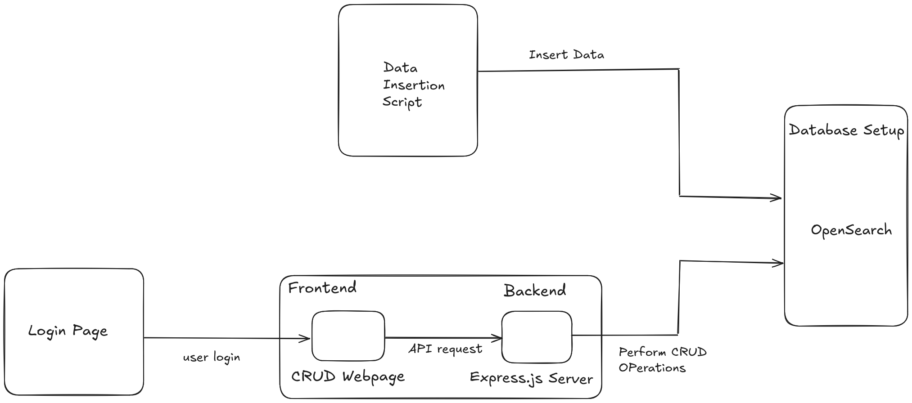

# Approach Paper - OpenSearch CRUD System

## Table of Contents
1. **Objective**  
2. **Proposed Solution**  
3. **Approach: Details**  
   - 3.1 **Architecture Diagram**  
   - 3.2 **Description**  
   - 3.3 **Pre-requisites**  
     - 3.3.1 **Hardware Requirements**  
     - 3.3.2 **Software Requirements**  
     - 3.3.3 **Networking Requirements**  

---

## 1. Objective
The goal of this project is to set up an OpenSearch database using Podman, insert large amounts of data, implement authentication, and provide a web interface for CRUD operations.

## 2. Proposed Solution
We propose using a containerized environment with Podman to set up OpenSearch while managing data insertion and API interactions through a backend service built with Express.js.

## 3. Approach: Details

### 3.1. Architecture Diagram

### 3.2. Description 
This approach involves:
- Setting up OpenSearch in a container using Podman.
- Using a Python script to insert 100,000 records into the database.
- Implementing authentication to ensure secure access.
- Creating a web interface for CRUD operations.
- Using Express.js as the backend to handle API requests and interact with OpenSearch.

#### **Pros:**
- Lightweight and easy to manage with Podman.
- Suitable for local development and testing.
- Provides better control over deployment.

#### **Cons:**
- Requires manual setup and maintenance.
- Scaling can be complex without additional configurations.

### 3.3. Pre-requisites

#### **3.3.1. Hardware Requirements**
- Minimum **4GB RAM, 2-core CPU**
- Sufficient storage for OpenSearch data

#### **3.3.2. Software Requirements**
- **Operating System:** Ubuntu 24.04 
- **Podman:** Version 4.9.3
- **OpenSearch:** Version 2.19.1
- **Python:** Version 3.12.3
- **Node.js & Express.js** Version 18.19.1

#### **3.3.3. Networking Requirements**
- Localhost access for development
- Internet connection for dependency installation
