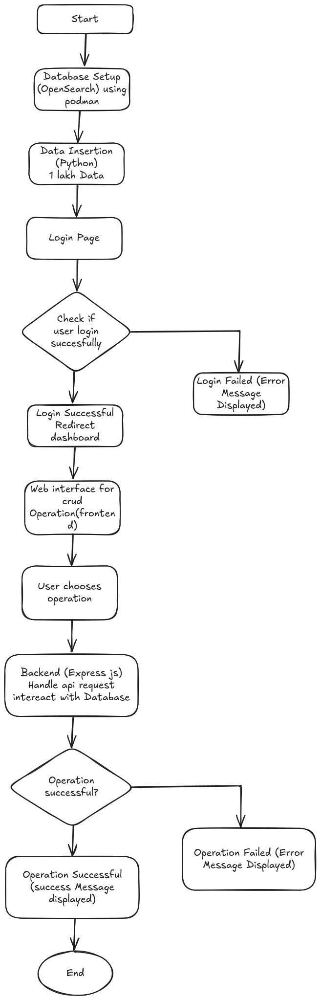
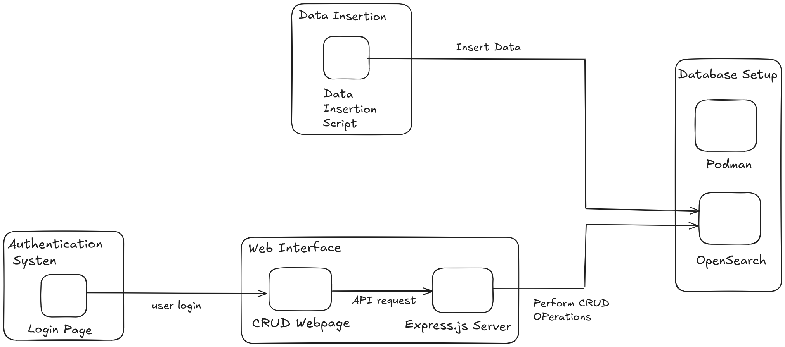

# **TEST CASES - OpenSearch CRUD System**  

  
  

## **Submitted By**  
**Ashna Dubey**  

## **Submitted To**  
**Vipin Tripathi**  

## **Reviewer Name**  
**Manmeet Narang**  

---

## **Goal**  
This project sets up **OpenSearch** using **Podman** (a container system), inserts **100,000 records** using a **Python script**, and provides a **web-based CRUD interface** built with **Express.js**. Users must **log in** before accessing CRUD functionalities.  

---

## **Table of Contents**  
- **TC 1**: Set up OpenSearch in Podman  
- **TC 2**: Verify OpenSearch Cluster Health  
- **TC 3**: Insert Bulk Data into OpenSearch  
- **TC 4**: Validate Data Insertion in OpenSearch  
- **TC 5**: Implement User Authentication (Login Page)  
- **TC 6**: Verify Authentication Flow  
- **TC 7**: Test CRUD Operations via Web Interface  
  - **TC 7.1**: Create Operation  
  - **TC 7.2**: Read Operation  
  - **TC 7.3**: Update Operation  
  - **TC 7.4**: Delete Operation  
- **TC 8**: API Security & Authentication Check  
- **TC 9**: OpenSearch Query Performance Testing  
- **NFR Test Cases**  

---

## **Test Environment**  
- **Platform**: Podman (for running OpenSearch in a container)  
- **Backend**: Express.js (handles API requests)  
- **Database**: OpenSearch  
- **Frontend**: Web interface for CRUD operations  

---

## **Test Cases**  

### **TC 1: Set Up OpenSearch in Podman**  
**Scenario**  
Ensure OpenSearch is running inside a Podman container.  

**Given**  
- Podman is installed on the system.  

**When**  
- The command to download and run OpenSearch in Podman is executed.  

**Then**  
- The OpenSearch container should start successfully.  
- Running `podman ps` should display OpenSearch as active.  

**Testing Outputs**  
(Screenshot showing the running container)  

---

### **TC 2: Verify OpenSearch Cluster Health**  
**Scenario**  
Check if OpenSearch is functioning properly.  

**Given**  
- OpenSearch is running in a container.  

**When**  
- The `GET /_cluster/health` API is called.  

**Then**  
- The API should return a `"green"` or `"yellow"` status, indicating that OpenSearch is healthy.  

**Testing Outputs**  
(JSON response from the OpenSearch cluster health check)  

---

### **TC 3: Insert Bulk Data into OpenSearch**  
**Scenario**  
Ensure 100,000 records can be inserted using a Python script.  

**Given**  
- OpenSearch is running.  
- The Python script has the correct OpenSearch connection details.  

**When**  
- The script is executed to insert data.  

**Then**  
- OpenSearch should successfully store all records.  
- No errors should occur during the insertion process.  

**Testing Outputs**  
(Log of inserted records and API response)  

---

### **TC 4: Validate Data Insertion in OpenSearch**  
**Scenario**  
Verify that OpenSearch correctly stores all 100,000 records.  

**Given**  
- Bulk data insertion was successful.  

**When**  
- The `GET /index_name/_count` API is called.  

**Then**  
- The API should return **100,000** records.  

**Testing Outputs**  
(JSON response showing the total records)  

---

### **TC 5: Implement User Authentication (Login Page)**  
**Scenario**  
Ensure users must log in before using CRUD operations.  

**Given**  
- A user opens the web interface.  

**When**  
- The user attempts to access CRUD operations **without logging in**.  

**Then**  
- The system should **redirect the user to the login page**.  

**Testing Outputs**  
(Screenshot showing redirection to the login page)  

---

### **TC 6: Verify Authentication Flow**  
**Scenario**  
Ensure only authenticated users can access CRUD functionalities.  

**Given**  
- A user exists with valid credentials.  

**When**  
- The user enters valid credentials and logs in.  

**Then**  
- The system should grant access to CRUD operations.  
- The API should return a session token.  

**Testing Outputs**  
(JSON response containing the authentication token)  

---

### **TC 7: Test CRUD Operations via Web Interface**  

#### **TC 7.1: Create Operation**  
**Scenario**  
Ensure users can add new records via the web interface.  

**Given**  
- The user is logged in.  

**When**  
- The user submits a new entry using the web interface.  

**Then**  
- The data should be stored in OpenSearch.  
- The API should return a **success response (201 Created)**.  

**Testing Outputs**  
(Screenshot of API response & UI confirmation)  

---

#### **TC 7.2: Read Operation**  
**Scenario**  
Ensure users can retrieve stored records.  

**Given**  
- OpenSearch contains records.  

**When**  
- The user searches for a specific record.  

**Then**  
- The system should fetch and display the correct record.  

**Testing Outputs**  
(JSON response with search results)  

---

### **TC 8: API Security & Authentication Check**  
**Scenario**  
Ensure that unauthenticated users cannot access the API.  

**Given**  
- The user is **not logged in**.  

**When**  
- The user attempts to access an API endpoint directly.  

**Then**  
- The API should return **401 Unauthorized**.  

**Testing Outputs**  
(JSON error response from the API)  

---

### **TC NFR 1: System Performance Under Load**  
**Scenario**  
Ensure OpenSearch can handle bulk data insertions and searches efficiently.  

**Given**  
- OpenSearch is running.  
- 100,000 records are stored in the database.  

**When**  
- The system performs bulk read/write operations.  

**Then**  
- OpenSearch should respond within acceptable latency limits (e.g., query response time < 500ms).  
- No crashes or performance degradation should occur.  

**Testing Outputs**  
(Response times from load tests)  

---

### **TC NFR 2: API Response Time Validation**  
**Scenario**  
Ensure API response times are within an acceptable range.  

**Given**  
- The backend server is running.  
- OpenSearch is accessible.  

**When**  
- API requests for CRUD operations are executed.  

**Then**  
- API should respond within 200-500ms under normal load.  
- Response time should not exceed 1s, even under peak load.  

**Testing Outputs**  
(API response times recorded from testing tools)  

---

### **TC NFR 3: Security & Access Control**  
**Scenario**  
Ensure unauthorized users cannot access API endpoints.  

**Given**  
- A user is not authenticated.  

**When**  
- The user attempts to access CRUD API endpoints without logging in.  

**Then**  
- The API should return **401 Unauthorized**.  
- Sensitive data should not be exposed in error responses.  

**Testing Outputs**  
(API logs showing failed access attempts)  

---

### **TC NFR 4: Scalability Testing**  
**Scenario**  
Ensure the system can scale as data volume increases.  

**Given**  
- The system contains 100,000 records.  
- A load balancer is configured.  

**When**  
- The number of records increases to 1 million or more.  

**Then**  
- OpenSearch should continue functioning without errors.  
- Performance degradation should be minimal.  

**Testing Outputs**  
(Logs showing system performance under heavy load)  

---

### **Conclusion**  
This test plan ensures that **OpenSearch is deployed correctly, data is stored and retrieved accurately, authentication works, and the system performs well under load**.  
